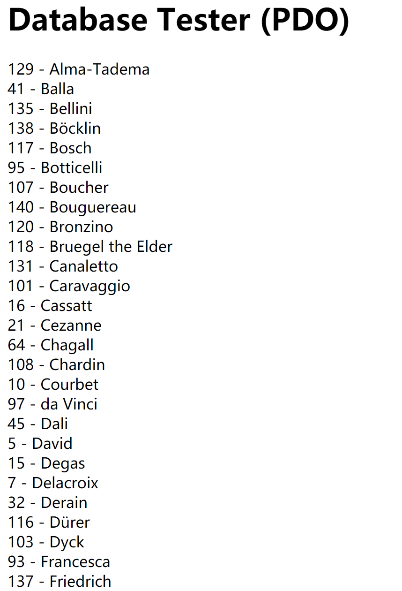
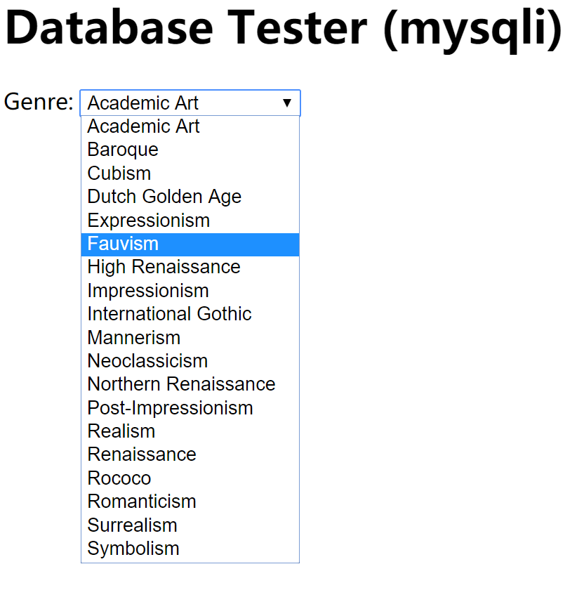

# Lab10 设计文档

**吴逸昕 19302010013**

-----------------

### Questions

#### Exercise 7

The execution of the first code accessed the database `art` according
to the configurations given by `config.php` and then printed all
the artists' corresponding id and lastname according to their 
lastname in alphabetical order. The database is accessed 
by PDO and allocating it with constants defined in `config.php`.
A `try...catch` structure is adopted to deal with errors and exceptions.

The second code achieved the effect of displaying a dropdown list of Genres
from the database, contents of which in alphabetical order again. The
database is accessed by using MySQLi this time and mysqli methods are invoked
to build a connection, execute SQL statements and print results. A prepositional
`if` statement is used in place of a `try...catch` structure to detect
possible connection errors this time.

#### Exercise 8

The function `outputSinglePainting($row)` is an essential part of the
function `outputPaintings()`. It prints HTML elements which contains
the images' source, title and description, achieving the effects of displaying
a particular single picture.

The function `outputPaintings()` uses PDO to set up a connection with 
the server and displays paintings based on the author's id, which is
received on clicking the author name-tags in the left column. By invoking
`outputSinglePainting($row)`, it then prints the selected author's masterpieces
one-by-one until there's no more.

The function `outputArtists()` is the out-most function, which sorts
the authors' lastnames according to alphabetical order and displays them
as links in the left column. HTML element `<a>` is created based on the information
retrieved from the SQL search. A confirmation process of the current artist
shown is included to determine whether his name should be in black or gray.
Then the artist's lastname is retrieved to act as the link itself.
 

#### Exercise 9

一、执行SQL语句的方式

- DriverManager：用于管理JDBC驱动的服务类。主要功能是获取Connection对象。

- Connection：代表数据库连接对象，每个Connection代表一个物理连接会话。

- Statement：用于执行SQL语句的工具接口。常用方法：

1、ResultSet  executeQuery（String sql）throws SQLException：专用于查询。

2、int  executeUpdate（String sql）throws SQLException：执行DDL、DML语句，前者返回0，后者返回受影响行数。

3、boolean execute（String sql）throws SQLException：可执行任何SQL 语句。如果执行后第一个结果为ResultSet（即执行了查询语句），则返回true；如果执行了DDL、DML语句，则返回false。返回结果为true，则随后可通过该Statement对象的getResultSet()方法获取结果集对象（ResultSet类型），返回结果为false，则可通过Statement对象的getUpdateCount（）方法获得受影响的行数。

——>PrepareStatement：为Statement的子接口，可预编译SQL 语句，常用语执行多条结构相同，仅值不同的SQL 语句，见下例。同样具有Statement对象常用的三个方法，但用法不同，因为已经预编译了SQL 月，所以无需再在方法中写sql语句，只需setString方法设置参数值即可，如代码中。

二、Prepared Statements的优势

1、PreparedStatement预编译SQL语句，性能更好，执行更快。

2、PreparedStatement无须“拼接”SQL 语句，编程更简单。

3、PreparedStatement可以防止SQL 注入（如将输入的true当成直接量，导致判断直接通过，从而降低了安全性），安全性更好

原文链接：https://blog.csdn.net/qq_19865749/java/article/details/52204928

-----------------
