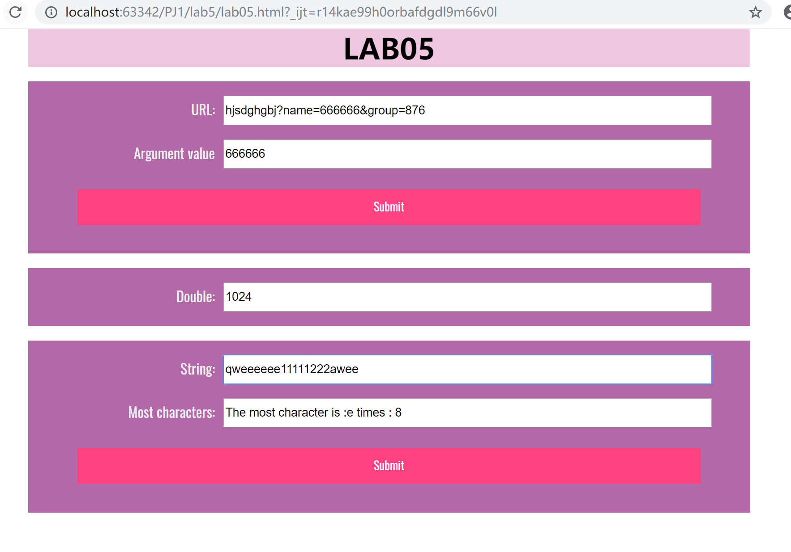
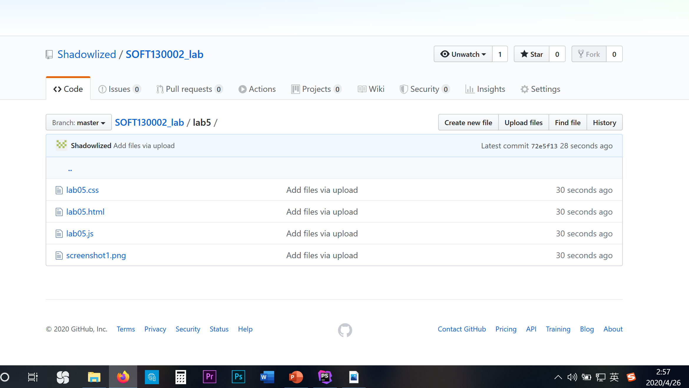

# Lab5 设计文档

**吴逸昕 19302010013**

-----------------

## 效果截图

## Github截图

----------------

### 函数与知识点总结

- `getElement`后需要使用`.value`对文本框内容赋值

- 使用了字符串的`indexOf`与`substring`方法以截取`name`的值

- 使用`new Date().getSeconds()`获取当前秒数

- 使用`setInterval(handler, timeout)`以达成每五秒执行一次的效果

- 多次循环：第一次用一个数组记录出现过哪些字符，第二次用另一个数组记录每个字符出现的次数（两层循环），第三次挑选出出现次数最多的字符，最后将值赋给`result.value`