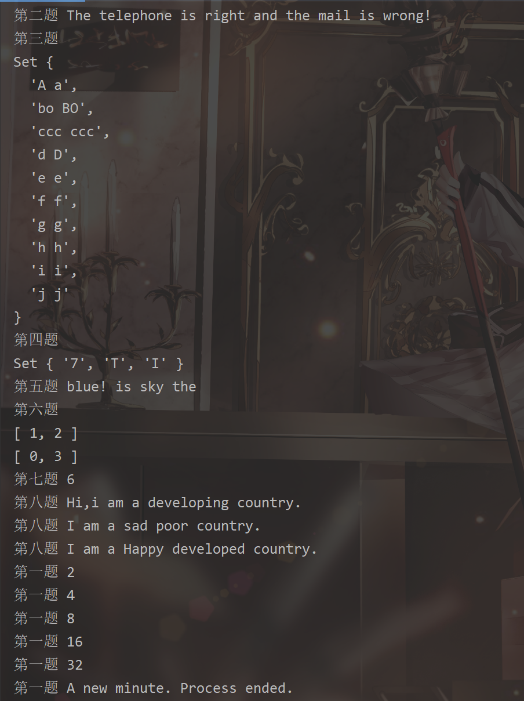
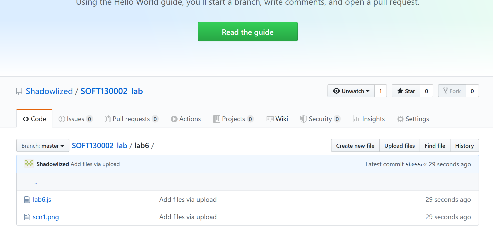

# Lab6 设计文档

**吴逸昕 19302010013**

-----------------

## 效果截图



## Github截图



----------------

### 正则表达式

- 正则表达式需定义在一对斜杠中

- `[0-9]`表示任取0-9间的数字，`{11}`表示匹配前一项11次

- `\w`表示任取a-zA-Z0-9间的字符， `+`表示匹配前一项一次或多次， 
`*`表示匹配前一项零次或多次， `[@]` `[.]`即匹配这两种符号
 
- `\b`确保只检测到一整个单词，`[a-z]+`表示匹配一个或多个字母，
`\1`指定第一个子匹配项，结尾处`i`表示不区分大小写，`g`表示尽可能多地匹配

- `/\s{2,}/g`表示找出所有的大于等于两个的空格

-----------------

### 不同继承方式

<ol>
<li>原型链：利用原型让一个引用类型继承另一个引用类型的属性和方法

```
Subtype.prototype = new SuperType();
```

<li>借用构造函数：在子类型构造函数的内部调用超类型构造函数

```
function SubType(){
    SuperType.call(this);
}
```  

<li>组合继承：将原型链和结合构造函数的技术结合到一块，使用原型链实现对原型属性和方法的继承，而通过借用构造函数来实现对实例属性的继承

```
function SubType(name, age){
    SuperType.call(this, name);
    this.age = age;
}
SubType.prototype = new SuperType();
SubType.prototype.constructor = SubType;
SubType.prototype.sayAge = function(){
    alert(this.age);
};
```

<li>原型式继承：借助原型基于已有对象创建新对象

```
function object(o){
    function F(){ }
    F.prototype = o;
    return new F();
}
```

使用`Object.create()`时：

```$xslt
var person = {
    name: "Nicholas",
    friends: ["Shelby", "Court", "Van"]
};
var anotherPerson = Object.creat(person);
anotherPerson.name = "Greg";
anotherPerson.friends.push("Rob");
```

<li>寄生式继承：创建一个仅用于封装继承过程的函数，该函数在内部以某种方式增强对象，最终返回对象

```$xslt
function createAnother(original){
    var clone = object(original);
    clone.sayHi = function(){
        alert("hi");
    };
    return clone;
}
```

<li>寄生组合式继承：通过借用构造函数来继承属性，通过原型链的混成形式来继承方法

```$xslt
function inheritPrototype(subType, superType){
    var prototype = object(superType.prototype);
    prototype.constructor = subType;
    subType.prototype = prototype;
}
```

</ol>

----------------------

### Map、Set、Array的区别与使用

- Map中为一个个键值对，除了同Set、Array一样存储值以外还存储了值对应的键名，其用于缓存频繁读取的数据，并通过get(键名)进行调用

- Set中的成员值都是唯一的，用于检测某一值是否存在，过滤掉重复的数据

- Array为数组，用于储存一系列相互存在关联的值，有丰富的操作方法